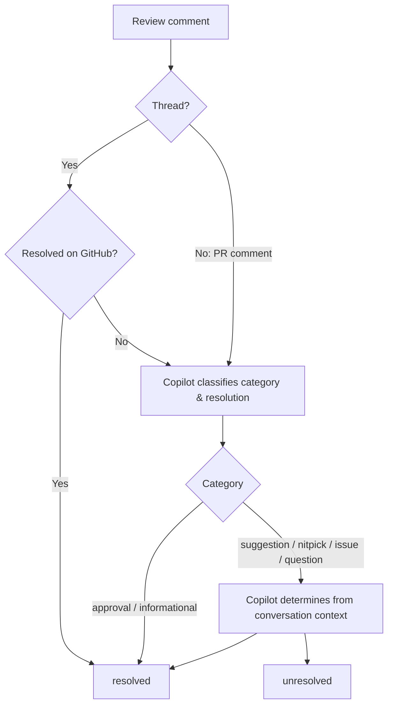

# gh-pr-reviews

`gh-pr-reviews` is a GitHub CLI (`gh`) extension that identifies unresolved review comments in a pull request.

It uses the [Copilot SDK](https://github.com/github/copilot-sdk) to classify each comment (suggestion, nitpick, issue, question, approval, informational) and determine whether it has been resolved.

## Usage

```bash
# Current branch's PR
$ gh pr-reviews

# Specific PR number
$ gh pr-reviews 123

# Specific repository
$ gh pr-reviews --repo owner/repo 123

# Show all comments including resolved ones
$ gh pr-reviews --all
```

### Output

By default, results are displayed in a colored Markdown-style format grouped by file path. Colors follow the GitHub Copilot brand palette and are automatically disabled when output is piped or `NO_COLOR` is set.

```
## src/handler.go

### suggestion (unresolved) — @reviewer

L42 | https://github.com/owner/repo/pull/123#discussion_r123456

This should use error wrapping

## PR Comments

### suggestion (unresolved) — @reviewer

https://github.com/owner/repo/pull/123#issuecomment-123456

Overall looks good but please address the error handling
```

Use `--json` to get machine-readable JSON output:

```bash
$ gh pr-reviews 123 --json
```

There are two types: `thread` (inline review thread) and `comment` (PR-level comment). `thread_id`, `path`, `line`, `commit_id`, and `diff_hunk` are only present for `thread` type. `comment_id` is the REST API comment ID, which can be used for replying.

```json
[
  {
    "thread_id": "PRRT_kwDOH7hXo85vAD-t",
    "comment_id": 2815812186,
    "type": "thread",
    "path": "src/handler.go",
    "line": 42,
    "commit_id": "abc1234def5678",
    "diff_hunk": "@@ -40,6 +40,7 @@ func handleRequest(w http.ResponseWriter, r *http.Request) {\n \tif err != nil {\n-\t\tlog.Println(err)\n+\t\treturn err",
    "author": "reviewer",
    "body": "This should use error wrapping",
    "url": "https://github.com/owner/repo/pull/123#discussion_r123456",
    "category": "suggestion",
    "resolved": false,
    "reason": "No follow-up addressing this feedback"
  },
  {
    "comment_id": 2815800000,
    "type": "comment",
    "author": "reviewer",
    "body": "Overall looks good but please address the error handling",
    "url": "https://github.com/owner/repo/pull/123#issuecomment-123456",
    "category": "suggestion",
    "resolved": false,
    "reason": "No follow-up addressing this feedback"
  }
]
```

### Comment Categories

| Category | Description |
|----------|-------------|
| `suggestion` | Code change proposals or improvement requests |
| `nitpick` | Minor style/formatting/naming issues |
| `issue` | Bug reports or problem identification |
| `question` | Questions about the code |
| `approval` | Approval comments (LGTM, looks good) |
| `informational` | FYI, context, or background information |

Only `suggestion`, `nitpick`, `issue`, and `question` categories are evaluated for resolution status. The rest (`approval`, `informational`) are always treated as resolved.

### Resolution Logic

Resolution status is determined by combining GitHub's native thread resolution state with Copilot-based analysis:

1. **GitHub-resolved threads** — If a review thread is marked as resolved on GitHub (via the "Resolve conversation" button), it is always treated as **resolved**, regardless of Copilot's analysis. PR-level comments have no GitHub resolution state, so this step only applies to inline review threads.
2. **Copilot analysis** — For threads not resolved on GitHub and for PR-level comments, Copilot classifies the comment category and determines resolution. As part of this analysis, `approval` and `informational` categories are always treated as resolved. For `suggestion`, `nitpick`, `issue`, and `question` categories, Copilot examines follow-up comments for evidence that the feedback was addressed or the question was answered.



## Install

```bash
$ gh extension install k1LoW/gh-pr-reviews
```

## Prerequisites

- [GitHub Copilot CLI](https://docs.github.com/en/copilot) >= 0.0.411 (`copilot --version` to check, `copilot update` to upgrade)

## Command Line Options

| Option | Short | Description |
|--------|-------|-------------|
| `--repo` | `-R` | Select another repository using the `[HOST/]OWNER/REPO` format |
| `--all` | `-a` | Show all review comments including resolved ones |
| `--json` | | Output results as JSON |
| `--width` | `-w` | Output width (0 for auto-detect, default: auto) |
| `--copilot-model` | | Copilot model to use for classification (default: `claude-haiku-4.5`) |
| `--verbose` | | Verbose output |

## Claude Code Skill Example

You can use `gh pr-reviews` as part of a [Claude Code](https://docs.anthropic.com/en/docs/claude-code) custom slash command (Skill). Below is an example skill that triages unresolved review comments by analyzing code context and classifying each comment as Agree / Partially Agree / Disagree.

Copy the content below into your project's `.claude/skills/triage-pr-reviews/SKILL.md` (or `~/.claude/skills/triage-pr-reviews/SKILL.md` for global use). The directory name becomes the slash command, so this skill is invoked as `/triage-pr-reviews` in Claude Code.

````markdown
# Triage PR Review Comments
1. Run `gh pr-reviews [arg] --json` to get unresolved review comments as JSON. If no argument is given, use the current branch's PR. Note: this command uses Copilot for classification and may take a while depending on the number of comments — use a longer timeout. Each JSON object contains:
   - `comment_id` (int): REST API comment ID — usable for replying via `gh api`
   - `thread_id` (string, only for `type: "thread"`): inline review thread ID
   - `type`: `"thread"` (inline review) or `"comment"` (PR-level)
   - `author`, `body`, `url`: comment metadata
   - `commit_id`, `path`, `line`, `diff_hunk` (only for `type: "thread"`): file location and diff context
   - `category`: one of `suggestion`, `nitpick`, `issue`, `question`, `approval`, `informational`
   - `resolved` (bool), `reason` (string): resolution status and rationale
2. Check if PR metadata (number, title, url) is already available from conversation context. If not (e.g., when a PR number/URL is explicitly passed as argument), run `gh pr view [arg] --json number,title,url` to get it.
3. For `type: "thread"` comments, use `path`, `line`, and `diff_hunk` from the JSON response to identify the exact file location. For `type: "comment"` (PR-level), there is no file location.
4. Check code context for each comment. Leverage any existing conversation context first. Only fetch additional context via `gh pr diff` or file reads when necessary.
5. Evaluate each comment against the code context. Classify as **Agree**, **Partially Agree**, or **Disagree** with a rationale and suggested action.
6. Output results in this format:

```
## Unresolved Review Comments Analysis

**PR**: #<number> (<title>)
**Unresolved comments**: <count>

---

### Comment 1 — [<category>] by @<author>
> <comment body>

**File**: `<path>` (line <line>)
**Assessment**: Agree | Partially Agree | Disagree
**Rationale**: <1-3 sentences>
**Suggested action**: <recommended action>

---

## Summary
- Agree: n — should be addressed
- Partially Agree: n — worth discussing
- Disagree: n — can be explained or dismissed
```

Do NOT write to GitHub (no commenting, resolving, or any mutations). Do NOT commit or push. If code context is unclear, use Grep to verify before making a judgment. Prefer `gh` commands over WebFetch for GitHub data.
````

## Contributing

To use this project from source, instead of a release:

    go build .
    gh extension remove pr-reviews
    gh extension install .
