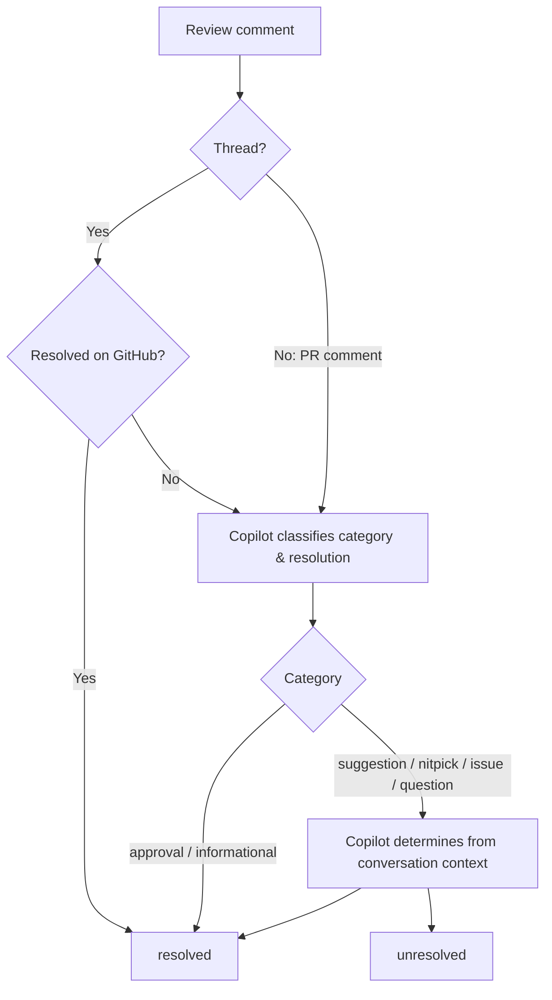

# gh-pr-reviews

`gh-pr-reviews` is a GitHub CLI (`gh`) extension that identifies unresolved review comments in a pull request.

It uses the [Copilot SDK](https://github.com/github/copilot-sdk) to classify each comment (suggestion, nitpick, issue, question, approval, informational) and determine whether it has been resolved.

## Usage

```bash
# Current branch's PR
$ gh pr-reviews

# Specific PR number
$ gh pr-reviews 123

# Specific repository
$ gh pr-reviews --repo owner/repo 123

# Show all comments including resolved ones
$ gh pr-reviews --all
```

### Output

By default, results are displayed in a colored Markdown-style format grouped by file path. Colors follow the GitHub Copilot brand palette and are automatically disabled when output is piped or `NO_COLOR` is set.

```
## src/handler.go

### suggestion (unresolved) — @reviewer

L42 | https://github.com/owner/repo/pull/123#discussion_r123456

This should use error wrapping

## PR Comments

### suggestion (unresolved) — @reviewer

https://github.com/owner/repo/pull/123#issuecomment-123456

Overall looks good but please address the error handling
```

Use `--json` to get machine-readable JSON output:

```bash
$ gh pr-reviews 123 --json
```

There are three types: `thread` (inline review thread), `comment` (PR-level comment), and `suppressed` (a finding Copilot listed in its review summary instead of posting inline, see [Suppressed comments](#suppressed-comments)). `thread_id`, `commit_id`, and `replies` are only present for `thread` type. `path`, `line`, and `diff_hunk` are present for `thread` and `suppressed` types. `comment_id` is the REST API comment ID, which can be used for replying, and is `0` for `suppressed`. `replies` contains follow-up comments in a thread (omitted when empty).

```json
[
  {
    "thread_id": "PRRT_kwDOH7hXo85vAD-t",
    "comment_id": 2815812186,
    "type": "thread",
    "path": "src/handler.go",
    "line": 42,
    "commit_id": "abc1234def5678",
    "diff_hunk": "@@ -40,6 +40,7 @@ func handleRequest(w http.ResponseWriter, r *http.Request) {\n \tif err != nil {\n-\t\tlog.Println(err)\n+\t\treturn err",
    "author": "reviewer",
    "body": "This should use error wrapping",
    "url": "https://github.com/owner/repo/pull/123#discussion_r123456",
    "category": "suggestion",
    "resolved": false,
    "reason": "No follow-up addressing this feedback",
    "replies": [
      {
        "author": "author",
        "body": "I'll fix this in the next commit",
        "created_at": "2025-01-02T12:00:00Z",
        "url": "https://github.com/owner/repo/pull/123#discussion_r123457"
      }
    ]
  },
  {
    "comment_id": 2815800000,
    "type": "comment",
    "author": "reviewer",
    "body": "Overall looks good but please address the error handling",
    "url": "https://github.com/owner/repo/pull/123#issuecomment-123456",
    "category": "suggestion",
    "resolved": false,
    "reason": "No follow-up addressing this feedback"
  },
  {
    "comment_id": 0,
    "type": "suppressed",
    "path": "src/handler.go",
    "line": 87,
    "diff_hunk": "\tfile, err := os.Open(dir)\n\tif err != nil {",
    "author": "copilot-pull-request-reviewer",
    "body": "This switch has no default case. Treat unknown values like ResultUnknown.",
    "url": "https://github.com/owner/repo/pull/123#pullrequestreview-123456",
    "category": "issue",
    "resolved": false,
    "reason": "Listed in the latest Copilot review and not addressed"
  }
]
```

### Suppressed comments

GitHub Copilot does not post every finding as an inline review comment. Low-confidence ones are collapsed into a `Suppressed comments` section of the review summary body, where they are invisible to the review threads API and easy to miss.

`gh pr-reviews` parses that section and reports each entry individually as `type: "suppressed"`, grouped under its file path just like an inline thread. These entries have no review thread on GitHub, so they cannot be replied to or resolved — `thread_id` is absent and `comment_id` is `0`. The `url` points at the review that contained them.

Copilot re-emits the full list of still-relevant findings on every re-review, so only the newest review reflects the current code. Entries that appear only in older reviews are reported as resolved and are therefore hidden unless `-a` is given.

### Comment Categories

| Category | Description |
|----------|-------------|
| `suggestion` | Code change proposals or improvement requests |
| `nitpick` | Minor style/formatting/naming issues |
| `issue` | Bug reports or problem identification |
| `question` | Questions about the code |
| `approval` | Approval comments (LGTM, looks good) |
| `informational` | FYI, context, or background information |

Only `suggestion`, `nitpick`, `issue`, and `question` categories are evaluated for resolution status. The rest (`approval`, `informational`) are always treated as resolved.

### Resolution Logic

Resolution status is determined by combining GitHub's native thread resolution state with Copilot-based analysis:

1. **GitHub-resolved threads** — If a review thread is marked as resolved on GitHub (via the "Resolve conversation" button), it is always treated as **resolved**, regardless of Copilot's analysis. PR-level comments have no GitHub resolution state, so this step only applies to inline review threads.
2. **Copilot analysis** — For threads not resolved on GitHub and for PR-level comments, Copilot classifies the comment category and determines resolution. As part of this analysis, `approval` and `informational` categories are always treated as resolved. For `suggestion`, `nitpick`, `issue`, and `question` categories, Copilot examines follow-up comments for evidence that the feedback was addressed or the question was answered.


```mermaid
flowchart TD
    A[Review comment] --> B{Thread?}
    B -->|Yes| C{Resolved on GitHub?}
    B -->|No: PR comment| D
    C -->|Yes| R[resolved]
    C -->|No| D[Copilot classifies category & resolution]
    D --> E{Category}
    E -->|approval / informational| R
    E -->|suggestion / nitpick / issue / question| F[Copilot determines from conversation context]
    F --> R
    F --> U[unresolved]
```

## Install

```bash
$ gh extension install k1LoW/gh-pr-reviews
```

## Prerequisites

- [GitHub Copilot CLI](https://docs.github.com/en/copilot) >= 1.0.51 (`copilot --version` to check, `copilot update` to upgrade)

## Command Line Options

| Option | Short | Description |
|--------|-------|-------------|
| `--repo` | `-R` | Select another repository using the `[HOST/]OWNER/REPO` format |
| `--all` | `-a` | Show all review comments including resolved ones |
| `--json` | | Output results as JSON |
| `--width` | `-w` | Output width (0 for auto-detect, default: auto) |
| `--copilot-model` | | Copilot model to use for classification (default: `claude-haiku-4.5`) |
| `--verbose` | | Verbose output |

## Agent Skill

This repository includes an example [Agent Skill](https://agentskills.io/) — [**triage-pr-reviews**](skills/triage-pr-reviews/SKILL.md). It uses `gh pr-reviews` to collect unresolved review comments, then analyzes code context for each comment and provides an assessment (Agree / Partially Agree / Disagree) with rationale.

You can install it via [skills.sh](https://skills.sh/):

```bash
$ npx skills add k1LoW/gh-pr-reviews
```

Or via [`gh skill`](https://cli.github.com/manual/gh_skill) (preview):

```bash
$ gh skill install k1LoW/gh-pr-reviews triage-pr-reviews
```

Or manually copy [`skills/triage-pr-reviews/SKILL.md`](skills/triage-pr-reviews/SKILL.md) to a location recognized by your agent (e.g., `.claude/skills/` for [Claude Code](https://docs.anthropic.com/en/docs/claude-code), `.github/skills/` for [GitHub Copilot Coding Agent](https://docs.github.com/en/copilot/using-github-copilot/using-copilot-coding-agent), or wherever your agent discovers skills).

## Contributing

To use this project from source, instead of a release:

    go build .
    gh extension remove pr-reviews
    gh extension install .
